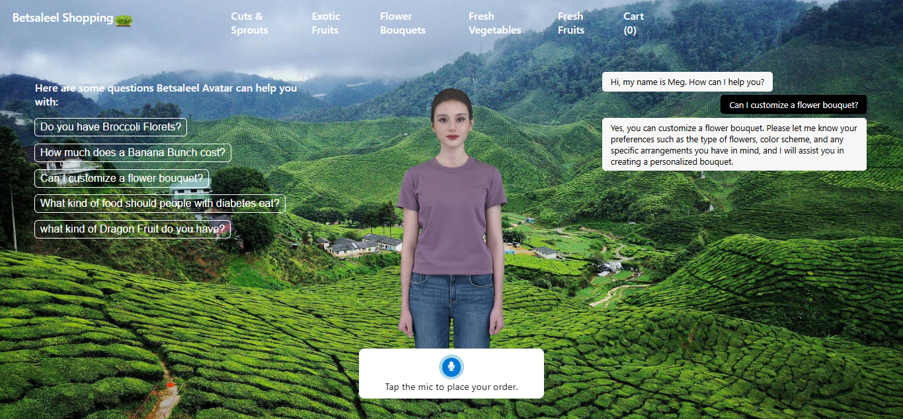
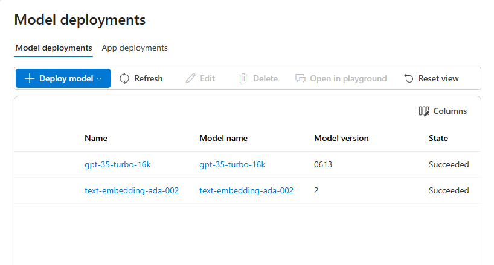
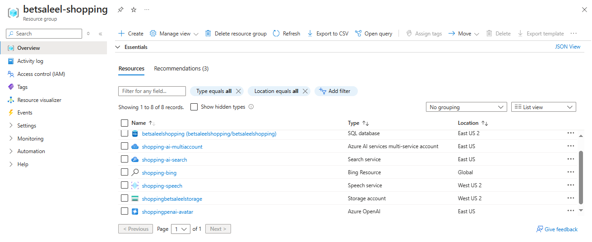

# Betsaleel Shopping Avatar
Discover my e-commerce website, featuring an AI-powered avatar that enhances your shopping experience. Shopping for fresh fruits, vegetables, exotic produce, and more has never been easier! Experience the convenience of our AI assistant, which lets you place orders and ask product-related questions effortlessly. Interact with our virtual assistant via text or voice chat, and enjoy a smarter way to shop for your favorite products!

✔Easily place orders and ask product-related questions through text or voice chat. 

✔Shop smarter and interact seamlessly with our virtual assistant!

### [Click on the image to watch the demo video on YouTube.](https://youtu.be/2gI4cmVJbqo)

[](https://youtu.be/2gI4cmVJbqo)

## Getting started

1. Clone this repository 
<br> ``` git clone https://github.com/Betsaleel237/BetsaleelShoppingAvatar.git ```

2. Create the following resources in Azure

    - Azure Speech Service in `westus2` or `westeurope` (avatars are only supported in these regions at this time). 
        - In case you select `westeurope` replace `westus2` by `westeurope` in `main.js` located in `src/js`.
    - Azure AI Search with default settings for indexing our data
    - Azure OpenAI Service with these models deployed
        1. gpt-35-turbo (**version 0613**)
        2. text-embedding-ada-002

            
    - Azure Blob Storage account : to store the product images
    - Azure AI services multi-service account 
    - Bing Search service
    - Azure SQL with the following settings
        1. Authentication: SQL and Microsoft Entra authentication enabled
        2. Networking: Allow Azure services and resources to access this server enabled


        

3. Create a blob container named **`product-images`** and upload the images located in `product-images`.<br>
    &nbsp; Generate a SAS for the container allowing to read all the images

4. Create a file named `local.settings.json` in the `backend` directory of the repository. Make sure to add the following variables to `local.settings.json`. 

```
{
    "IsEncrypted": false,
    "Values": {
      "AzureWebJobsStorage": "",
      "FUNCTIONS_WORKER_RUNTIME": "python",
      "PYTHON_ENABLE_INIT_INDEXING": "1",
      "AZURE_OPENAI_ENDPOINT": "https://shoppingpenai-avatar.openai.azure.com/",
      "AZURE_OPENAI_API_KEY": "XXXX",
      "AZURE_OPENAI_CHAT_DEPLOYMENT" : "gpt-35-turbo-16k",
      "AZURE_OPENAI_EMBEDDINGS_DEPLOYMENT" : "text-embedding-ada-002",
      "AZURE_OPENAI_API_VERSION" : "2023-07-01-preview",
      "AZURE_SEARCH_ENDPOINT": "https://shopping-ai-search.search.windows.net",
      "AZURE_SEARCH_API_KEY": "XXXX",
      "AZURE_SEARCH_INDEX": "products",
      "AZURE_SPEECH_REGION": "westus2",
      "AZURE_SPEECH_API_KEY": "XXXX",
      "BLOB_SAS_URL": "XXXX",
      "SQL_DB_SERVER": "betsaleelshopping.database.windows.net",
      "SQL_DB_USER": "betsaleelshopping",
      "SQL_DB_PASSWORD": "XXXX",
      "SQL_DB_NAME": "betsaleelshopping ",
      "BING_KEY": "XXXX",
      "BING_SEARCH_URL": "https://api.bing.microsoft.com/"
    }
  }
```
5. Run the cells in the `index-and-database.ipynb` notebook to upload the product data to Azure AI Search and the Azure SQL Database.

6. You can deploy this application using Azure Static Web Apps. 

    If you are using **Visual Studio Code**, you can execute the following steps:
    - Install  the Azure Static Web Apps and Azure Functions extensions
    - Right-click on Static Web Apps extension folder, select **Create Static Web App ... (Advanced)** with the following parameters:  

      | Parameter                 | Description                                                      |
      |---------------------------|------------------------------------------------------------------|
      | Resource group            | rg-Betsaleel-shopping                                               |
      | Name                      | Betsaleel-shopping-website                                       |
      | Pricing option            | Standard                                                         |
      | Region                    | westus2                                                          |
      | Framework                 | Custom                                                           |
      | Application code location | /src                                           |
      | Build output location     | (Leave blank)                                                    |      


8. In the VSCode Static Web Apps extension, navigate to **Application Settings** of your app and right-click **Upload Local Settings**. This will populate the settings from `local.settings.json` to the web app.

8. In the VSCode Static Web Apps extension, right-click on your app name and select **Browse site** to use the app